# FlowCast

**Reproducible multi-horizon traffic forecasting and congestion intelligence**

FlowCast is a Streamlit application and Python pipeline for forecasting traffic
conditions across a 25-road corridor. From immutable traffic, weather, and
calendar inputs, it builds leakage-safe features, compares classical and deep
learning models, quantifies uncertainty, serves frozen-model predictions, and
exports traceable reports.

The v1.0 release covers the complete path from raw-source validation to a
ten-route dashboard. Every displayed value comes from verified data or a
persisted model output—there are no placeholder analytics.

**Release:** v1.0 delivered · **Runtime:** Python 3.11 · **UI:** Streamlit
1.59.2 · **Deep learning:** PyTorch 2.13.0 · **Tests:** 192 passing

## Contents

- [What FlowCast does](#what-flowcast-does)
- [Product capabilities](#product-capabilities)
- [System architecture](#system-architecture)
- [Data and evaluation contract](#data-and-evaluation-contract)
- [Models, weights, and selection](#models-weights-and-selection)
- [Evaluated results](#evaluated-results)
- [Known constraints](#known-constraints)
- [Requirements](#requirements)
- [Install and run from a fresh clone](#install-and-run-from-a-fresh-clone)
- [Use the CLI](#use-the-cli)
- [Optional NVIDIA acceleration](#optional-nvidia-acceleration)
- [Testing and verification](#testing-and-verification)
- [Repository structure](#repository-structure)
- [Reproducibility and traceability](#reproducibility-and-traceability)
- [Project documentation](#project-documentation)

## What FlowCast does

For each road segment, FlowCast forecasts four future 30-minute windows:

| Horizon | Forecast offset |
|---:|---:|
| h1 | 30 minutes |
| h2 | 60 minutes |
| h3 | 90 minutes |
| h4 | 120 minutes |

Every prediction contains:

- traffic volume;
- average speed;
- travel time;
- congestion class: Free-flow, Moderate, Heavy, or Severe;
- accident-risk probability and operating decision;
- regression intervals or classifier confidence;
- origin and target timestamps;
- exact data, configuration, and model versions.

The default request covers all 25 roads and all four horizons. A complete
request therefore produces 100 prediction rows.

## Product capabilities

### End-to-end data and modelling pipeline

- Audits delivered files and preserves their SHA-256 identity.
- Validates schemas, domains, physical limits, keys, and timestamps.
- Quarantines invalid records with explicit reasons.
- Reconstructs the complete half-hour road grid.
- Aligns hourly weather and daily calendar context without row multiplication.
- Builds road-local lags and shifted rolling statistics without target leakage.
- Creates five targets across four forecast horizons.
- Uses chronological train, validation, and test partitions.
- Fits imputers, encoders, and scalers on training data only.
- Trains and evaluates classical regression, classification, and recurrent
  deep-learning models.
- Calibrates probabilities and split-conformal regression intervals using
  validation evidence only.
- Persists models, predictions, metrics, model cards, hashes, and lineage.
- Exposes deterministic CLI prediction and CSV/HTML report generation.

### Streamlit dashboard

The application entry point is `dashboard/app.py`. Its ten routes are:

1. Live predictions
2. Historical trends
3. Congestion heatmap
4. Road comparison
5. Model performance
6. Feature importance
7. Forecast visualization
8. Prediction confidence
9. Weather versus traffic
10. Data and training

The dashboard loads verified artifacts instead of retraining on each rerun. It
also supports:

- shared road, date, and horizon controls;
- all 7,237 full-corridor forecast origins with sufficient recurrent history;
- upload validation and hash-addressed staging;
- explicit, confirmation-gated retraining into a new version;
- verified CSV and self-contained HTML report downloads;
- data/model/config lineage and limitations beside the displayed results.

## System architecture

```mermaid
flowchart LR
    A["Immutable CSV sources"] --> B["Audit, validation, and quarantine"]
    B --> C["Cleaning and half-hour grid recovery"]
    C --> D["Weather and calendar merge"]
    D --> E["Leakage-safe features and targets"]
    E --> F["Chronological splits and preprocessing"]
    F --> G["Classical models"]
    F --> H["Recurrent volume model"]
    G --> I["Registry and confidence layer"]
    H --> I
    I --> J["Frozen Predictor interface"]
    J --> K["Prediction Parquet and manifest"]
    K --> L["CSV and HTML reports"]
    K --> M["Streamlit dashboard"]
```



The Streamlit pages remain thin. Data verification, analytics, model loading,
prediction, reports, uploads, and retraining controls live in package services
under `src/flowcast/`.

## Data and evaluation contract

### Delivered data

| Property | Verified value |
|---|---:|
| Corridor roads | 25 |
| Source period | 1 January–31 May 2025 |
| Source traffic rows | 178,468 |
| Duplicate traffic rows quarantined | 1,767 |
| Missing half-hour windows reconstructed | 4,499 |
| Complete processed road/timestamp rows | 181,200 |
| Raw accident-positive rows | 1,669 (0.9352%) |
| Candidate model features | 62 |
| Forecast targets | 5 × 4 horizons |

Traffic is keyed by `road_id + timestamp`. Weather is aligned through each
road's weather station at the corresponding hour, and calendar data joins on
date. Raw source files are never edited in place.

### Chronological evaluation

| Partition | Timestamps | Range |
|---|---:|---|
| Train | 5,074 | 2025-01-01 00:00–2025-04-16 16:30 |
| Validation | 1,087 | 2025-04-16 17:00–2025-05-09 08:00 |
| Test | 1,087 | 2025-05-09 08:30–2025-05-31 23:30 |

Candidate comparison uses five expanding-window cross-validation folds with a
four-window gap. Hyperparameters and family winners are selected from
cross-validation and validation results, frozen, and only then evaluated once
on the test partition. Final metrics never use a random split.

Primary metrics are:

- **Volume, speed, and travel time:** RMSE, supported by MAE, MAPE, and R².
- **Congestion:** Macro-F1, supported by accuracy, precision, recall, and
  confusion matrices.
- **Accident risk:** ROC-AUC, supported by PR-AUC and threshold-level precision,
  recall, and F1.

## Models, weights, and selection

### Evaluated model families

| Layer | Evaluated implementations |
|---|---|
| Mathematical proof | NumPy linear regression with explicit gradient descent |
| Classical regression | scikit-learn Linear Regression, Decision Tree, Random Forest, XGBoost |
| Classical classification | Decision Tree, Random Forest, XGBoost, linear SVM |
| Deep learning | Two from-scratch multi-horizon LSTM candidates |
| Confidence | Split-conformal regression intervals, calibrated probabilities, entropy, and reliability tables |

Classical regression evaluates seven configured candidates for each of 12
target/horizon jobs. Classification evaluates eight candidates for each of
eight jobs. The deep layer evaluates two predeclared LSTM candidates on common
validation origins.

The selected recurrent candidate is `lstm_s12_h32`:

- 12 half-hour input steps;
- 64 transformed features;
- one 32-unit unidirectional LSTM layer;
- 32-unit dense head with 0.20 dropout;
- four simultaneous volume outputs;
- selected at epoch 8 using validation mean RMSE;
- no pretrained weights.

### Persisted weights and metadata

Generated model files are intentionally excluded from Git because they are
reproducible from the delivered sources.

| Artifact | Generated location |
|---|---|
| Scratch NumPy parameters | `artifacts/models/scratch_linear_v1/model.json` |
| 12 selected regression pipelines | `artifacts/models/classical_regression_v1/*.joblib` |
| 8 selected classification pipelines | `artifacts/models/classical_classification_v1/*.joblib` |
| Recurrent state dictionary | `artifacts/models/recurrent_volume_v1/best_checkpoint.pt` |
| Recurrent feature schema and target scaler | `artifacts/models/recurrent_volume_v1/` |
| Family-specific preprocessors | `artifacts/models/split_preprocessing_v1/*.joblib` |

The recurrent checkpoint is a portable PyTorch state dictionary and is always
loaded with an explicit device mapping. Each selected model has a JSON and
Markdown model card under `artifacts/model_cards/` containing its target,
horizon, features, preprocessing version, split, hyperparameters, seed,
metrics, limitations, and artifact hashes.

The classical registry contains 20 verified entries:

```text
{target}/{horizon}/{model_name}/{version}
```

The registry recursively verifies the model, card, prediction source,
preprocessing contract, processed-data identity, selection evidence, and
configuration before resolving an entry.

## Evaluated results

All values below are frozen hold-out results unless explicitly marked as
validation-only.

### Acceptance summary

| Goal | Required | Observed | Result |
|---|---:|---:|---|
| Volume accuracy | MAPE ≤ 12% at all horizons | 10.218%–10.952% | Met |
| Congestion classification | Macro-F1 ≥ 0.80 | 0.7468–0.7540 | Not met |
| Accident ranking | ROC-AUC ≥ 0.75 | 0.5894–0.6237 | Not met |
| Deep volume benchmark | Beat classical RMSE at all horizons | Wins 3 of 4 | Not met |
| Cold inference latency | ≤ 30 seconds | 3.309 seconds | Met |
| 90% regression intervals | Near 90% empirical coverage | 0.8924–0.9055 | Met as diagnostic |

Targets that were not reached remain visible; no post-test tuning was used to
hide them.

### NumPy linear-regression proof

This is a mathematical verification on the next-window volume target, not a
production selection. It uses a bounded training slice and validation data; it
never loads the test partition.

| Estimator | RMSE | MAE | MAPE | R² |
|---|---:|---:|---:|---:|
| NumPy gradient descent | 86.9331 | 62.9818 | 18.2032% | 0.9027 |
| scikit-learn LinearRegression | 80.8723 | 59.1634 | 16.5849% | 0.9158 |

All six analytical gradient parameters passed central finite-difference checks
with maximum absolute error `2.642e-09`.

### Selected classical regression models

Random Forest won validation selection for all 12 regression jobs.

| Target | Horizon | Candidate | Test RMSE | Test MAE | Test MAPE | Test R² |
|---|---:|---|---:|---:|---:|---:|
| Volume | 30 min | `forest_deep` | 63.4595 | 42.2054 | 10.218% | 0.9514 |
| Volume | 60 min | `forest_deep` | 62.8626 | 42.0109 | 10.263% | 0.9522 |
| Volume | 90 min | `forest_balanced` | 65.3058 | 44.0438 | 10.952% | 0.9483 |
| Volume | 120 min | `forest_deep` | 62.0092 | 41.6263 | 10.295% | 0.9533 |
| Speed | 30 min | `forest_deep` | 3.7400 | 2.8214 | 9.029% | 0.8980 |
| Speed | 60 min | `forest_deep` | 3.7683 | 2.8538 | 9.056% | 0.8960 |
| Speed | 90 min | `forest_balanced` | 3.7940 | 2.8715 | 9.145% | 0.8944 |
| Speed | 120 min | `forest_balanced` | 3.7923 | 2.8731 | 9.085% | 0.8945 |
| Travel time | 30 min | `forest_deep` | 1.1426 | 0.4610 | 9.753% | 0.8065 |
| Travel time | 60 min | `forest_deep` | 1.0949 | 0.4393 | 9.316% | 0.8210 |
| Travel time | 90 min | `forest_deep` | 1.0822 | 0.4291 | 9.012% | 0.8247 |
| Travel time | 120 min | `forest_deep` | 1.1016 | 0.4381 | 9.203% | 0.8184 |

Complete candidate, fold, family, feature-importance, and selection evidence is
stored in
[`artifacts/metrics/classical_regression_v1/`](artifacts/metrics/classical_regression_v1/).

### Selected classical classification models

| Target | Horizon | Selected model | Test accuracy | Primary metric | Result |
|---|---:|---|---:|---:|---|
| Congestion | 30 min | Random Forest `forest_deep` | 0.8638 | Macro-F1 0.7540 | Below 0.80 |
| Congestion | 60 min | XGBoost `xgb_deep` | 0.8531 | Macro-F1 0.7503 | Below 0.80 |
| Congestion | 90 min | XGBoost `xgb_deep` | 0.8512 | Macro-F1 0.7493 | Below 0.80 |
| Congestion | 120 min | Random Forest `forest_balanced` | 0.8537 | Macro-F1 0.7468 | Below 0.80 |
| Accident | 30 min | SVM `svm_regularized` | 0.9311 | ROC-AUC 0.6209 · PR-AUC 0.0209 | Below 0.75 |
| Accident | 60 min | SVM `svm_regularized` | 0.9776 | ROC-AUC 0.6237 · PR-AUC 0.0182 | Below 0.75 |
| Accident | 90 min | SVM `svm_default` | 0.9691 | ROC-AUC 0.5980 · PR-AUC 0.0161 | Below 0.75 |
| Accident | 120 min | SVM `svm_regularized` | 0.9156 | ROC-AUC 0.5894 · PR-AUC 0.0165 | Below 0.75 |

Accident accuracy is not used for selection because fewer than 1% of rows are
positive. ROC-AUC, PR-AUC, positive support, and validation-selected operating
thresholds are the relevant evidence.

Complete calibration, thresholds, confusion matrices, candidate results, and
feature importance are stored in
[`artifacts/metrics/classical_classification_v1/`](artifacts/metrics/classical_classification_v1/).

### Deep LSTM versus Random Forest volume

This comparison restricts both models to the exact same 26,500 test origins per
horizon.

| Horizon | LSTM RMSE | RF RMSE | LSTM MAPE | RF MAPE | RMSE winner |
|---:|---:|---:|---:|---:|---|
| 30 min | 60.1443 | 63.2354 | 10.210% | 10.232% | LSTM |
| 60 min | 60.8154 | 62.6833 | 10.388% | 10.288% | LSTM |
| 90 min | 61.2014 | 65.0565 | 10.979% | 10.969% | LSTM |
| 120 min | 61.8966 | 61.8495 | 11.535% | 10.318% | Random Forest |

The LSTM beats Random Forest on RMSE at 30, 60, and 90 minutes. At 120
minutes, it trails by only `0.0471` RMSE. Its test R² remains between 0.9536 and
0.9561 across the four horizons.

See
[`artifacts/metrics/recurrent_volume_v1/`](artifacts/metrics/recurrent_volume_v1/)
for training curves, candidate selection, sequence checks, the shared-origin
comparison, and checkpoint lineage.

## Known constraints

- **Single corridor and fixed historical inputs.** v1.0 covers 25 roads from
  January through May 2025; it is not a multi-city platform.
- **Batch/near-term analytics, not streaming control.** It does not operate
  traffic signals or ingest a continuous production event stream.
- **Historical forecast origins.** Requests must use exact half-hour origins
  present in the verified processed dataset with enough recurrent history.
- **No future-weather feed.** Forecasts use weather known at the origin and do
  not fabricate future weather.
- **Rare accident events.** The 0.9352% source positive rate limits ranking and
  threshold performance. Accident outputs are decision support only and must
  not be used as an autonomous safety control.
- **Unmet modelling targets remain.** Congestion Macro-F1, accident ROC-AUC,
  and the all-horizon deep-over-classical goal were not achieved.
- **Uploads are staged, not silently activated.** A valid upload does not
  overwrite immutable sources, retrain automatically, or switch model routing.
- **Retraining is synchronous in v1.0.** It requires explicit confirmation,
  writes a new version, and leaves active routing unchanged.
- **CPU is the portability identity.** CUDA is optional; the Intel NPU is not
  supported.
- **Independent portability confirmation remains.** The complete clean run was
  verified on Windows. A macOS or Linux reproduction is the remaining
  release-confidence follow-up.
- **No API server or database.** The Streamlit app and CLI call the modular
  Python backend directly.
- **No repository license is currently declared.** Add an appropriate license
  before granting public reuse rights.

## Requirements

### Software

- Git
- CPython **3.11.x** (`>=3.11,<3.12`)
- `pip`
- Windows, macOS, or Linux

All direct dependencies are pinned in `pyproject.toml`. The complete
installation includes NumPy, pandas, PyArrow, scikit-learn, XGBoost, PyTorch,
Streamlit, Plotly, Matplotlib, JupyterLab, and pytest.

### Resource expectations

CPU-only execution is supported and is the canonical reproduction path. The
measured Windows acceptance run:

- completed all 16 stages in **520.287 seconds**;
- used explicit CPU recurrent training;
- produced approximately **0.27 GiB** under its isolated output root;
- used a local virtual environment of approximately **3.76 GiB**.

Allow at least 6 GiB of free disk space for the environment, generated
artifacts, and installation overhead. Full model training is CPU-intensive;
close other CPU- or memory-heavy applications if resources are constrained.
The dashboard and ordinary inference are much lighter.

## Install and run from a fresh clone

A fresh clone includes source code, configurations, delivered CSV/DOCX inputs,
metric scoreboards, and model cards. Large generated datasets, predictions,
runtime prediction reports, and model weights are ignored by Git and are
rebuilt locally.

The output directory passed to `run-all` must be a **new, empty child** beneath
`artifacts/reproductions/`. Choose a new name if a previous attempt already
created it.

### Windows PowerShell

```powershell
git clone https://github.com/atrx07/FlowCast.git
Set-Location FlowCast

py -3.11 --version
py -3.11 -m venv .venv
.\.venv\Scripts\python.exe -m pip install --upgrade pip
.\.venv\Scripts\python.exe -m pip install -e ".[classical,deep,eda,dashboard,test]"
.\.venv\Scripts\python.exe -m pip check
```

The version command must report Python 3.11. If the Windows Python launcher is
unavailable, use a `python` executable that resolves to Python 3.11.

Build and permanently verify a clean CPU reproduction:

```powershell
.\.venv\Scripts\python.exe -m flowcast.cli run-all `
  --output-root artifacts\reproductions\flowcast_local_cpu `
  --recurrent-device cpu

.\.venv\Scripts\python.exe -m flowcast.cli verify-reproduction `
  --output-root artifacts\reproductions\flowcast_local_cpu
```

Run the test suite:

```powershell
.\.venv\Scripts\python.exe scripts\run_tests.py -q
```

Launch the dashboard against the reproduced artifacts:

```powershell
$env:FLOWCAST_OUTPUT_ROOT = "artifacts\reproductions\flowcast_local_cpu"
.\.venv\Scripts\python.exe -m streamlit run dashboard\app.py
```

Open the local URL printed by Streamlit, normally
`http://localhost:8501`.

### macOS or Linux

```bash
git clone https://github.com/atrx07/FlowCast.git
cd FlowCast

python3.11 --version
python3.11 -m venv .venv
.venv/bin/python -m pip install --upgrade pip
.venv/bin/python -m pip install -e ".[classical,deep,eda,dashboard,test]"
.venv/bin/python -m pip check
```

Build and verify:

```bash
.venv/bin/python -m flowcast.cli run-all \
  --output-root artifacts/reproductions/flowcast_local_cpu \
  --recurrent-device cpu

.venv/bin/python -m flowcast.cli verify-reproduction \
  --output-root artifacts/reproductions/flowcast_local_cpu

.venv/bin/python scripts/run_tests.py -q
```

Launch Streamlit:

```bash
FLOWCAST_OUTPUT_ROOT=artifacts/reproductions/flowcast_local_cpu \
  .venv/bin/python -m streamlit run dashboard/app.py
```

## Use the CLI

After setting `FLOWCAST_OUTPUT_ROOT` to a completed reproduction, the CLI and
dashboard resolve the same verified artifacts.

### Generate predictions and reports

PowerShell:

```powershell
$env:FLOWCAST_OUTPUT_ROOT = "artifacts\reproductions\flowcast_local_cpu"
.\.venv\Scripts\python.exe -m flowcast.cli predict `
  --roads NL-001 NL-002 `
  --horizons 1 2 3 4 `
  --device cpu `
  --export-reports
```

Bash:

```bash
FLOWCAST_OUTPUT_ROOT=artifacts/reproductions/flowcast_local_cpu \
  .venv/bin/python -m flowcast.cli predict \
  --roads NL-001 NL-002 \
  --horizons 1 2 3 4 \
  --device cpu \
  --export-reports
```

Omit `--roads` for all 25 roads, `--horizons` for all horizons, or `--origin`
for the latest common eligible origin. Prediction does not contain a training
path.

To rebuild reports from an existing verified prediction batch:

```powershell
.\.venv\Scripts\python.exe -m flowcast.cli build-reports `
  --manifest <path-to-prediction-manifest.json>
```

### Pipeline commands

The CLI also exposes individual stages:

```text
audit
validate
clean-context
clean-traffic
merge-sources
engineer-features
prepare-data
eda
prepare-modeling
train-scratch-linear
train-classical-regression
train-classical-classification
build-classical-registry
train-recurrent-volume
analyze-confidence
predict
build-reports
run-all
verify-reproduction
```

Use `python -m flowcast.cli <command> --help` for exact arguments. Prefer
`run-all` for a clean end-to-end reproduction because it redirects every
writable path into an isolated root and records complete stage evidence.

## Optional NVIDIA acceleration

CUDA is optional and is not required for installation, testing, inference, or
the canonical reproduction. On a compatible NVIDIA Windows or Linux machine,
install the approved PyTorch wheel after installing the portable project:

```powershell
.\.venv\Scripts\python.exe -m pip install --force-reinstall -r requirements-cuda.txt
.\.venv\Scripts\python.exe -c "import torch; print(torch.__version__, torch.version.cuda, torch.cuda.is_available(), torch.cuda.get_device_name(0) if torch.cuda.is_available() else 'CPU')"
```

The verified local accelerator was an NVIDIA GeForce RTX 5070 Laptop GPU with
PyTorch `2.13.0+cu130`. A separate system-wide CUDA Toolkit is not required by
the wheel.

For an accelerated experiment, pass `--recurrent-device cuda` or `auto` to
`run-all`. CUDA and CPU training may select different validation winners due to
floating-point trajectories, so CUDA output must use its own reproduction root
and must not overwrite the CPU release evidence.

## Testing and verification

Always run pytest through the repository wrapper:

```powershell
.\.venv\Scripts\python.exe scripts\run_tests.py -q
```

On success it prints:

```text
FLOWCAST_PYTEST_EXIT=0
```

The complete suite currently contains **192 passing tests** and covers:

- raw schemas and audit hashes;
- cleaning, merge, feature, and target contracts;
- leakage and chronological split isolation;
- training-only preprocessing;
- gradient and synthetic proofs;
- classical candidate coverage and frozen selection;
- calibration, thresholds, and probability normalization;
- recurrent sequence isolation and checkpoint reload equality;
- registry and artifact tamper rejection;
- confidence and error-analysis reconciliation;
- deterministic CPU inference and report verification;
- Streamlit imports, all-page smoke tests, and dashboard contracts;
- complete reproduction and repository mutation safeguards.

Tests that write artifacts are redirected to temporary roots. The session-wide
guard snapshots every tracked file, restores any mutation, and fails the run
with the offending paths.

The clean acceptance evidence reports:

- 16 pipeline stages completed;
- unchanged delivered-source hashes;
- permanent verification `passed: true`;
- maximum metric delta `1.0842021724855044e-17` against tolerance `1e-12`;
- 20 classical registry entries and 21 model cards;
- deterministic portable CPU inference;
- ten dashboard routes without browser or console errors.

## Repository structure

```text
FlowCast/
├── FlowCast-project_file/   # Read-only PRD, dictionary, and delivered CSVs
├── config/                  # Versioned data, model, confidence, and inference contracts
├── dashboard/               # Streamlit entry point and ten page scripts
├── data/
│   ├── raw/                 # Immutable byte-identical working copies
│   ├── interim/             # Validated, cleaned, merged, and feature data
│   ├── processed/           # Final modelling tables
│   └── quarantine/          # Rejected rows and reason evidence
├── artifacts/
│   ├── metrics/             # Tracked scoreboards and evaluation evidence
│   ├── model_cards/         # Tracked model documentation
│   ├── models/              # Generated weights and preprocessors
│   ├── predictions/         # Generated Parquet batches and manifests
│   ├── reports/             # Generated CSV/HTML and tracked EDA reports
│   └── reproductions/       # Isolated full-run roots
├── notebooks/               # Reproducible EDA notebook
├── scripts/                 # Exact-exit test runner
├── src/flowcast/            # Modular data, modelling, evaluation, inference, and UI services
├── tests/                   # Unit, data-contract, integration, and smoke coverage
├── FINAL_REPORT.md          # Final metrics, limitations, and acceptance findings
├── pyproject.toml           # Package metadata and pinned dependency groups
└── README.md
```

## Reproducibility and traceability

Every material artifact is versioned and hash-addressed. A displayed prediction
can be traced through:

```text
prediction row
  → prediction manifest
  → model registry entry
  → model + model card
  → feature/preprocessing manifest
  → processed dataset version
  → stage evidence
  → immutable source hashes
```

`run-all` redirects all writable paths into the requested reproduction root and
executes the full 16-stage pipeline. `verify-reproduction` then checks:

- delivered source bytes;
- every primary stage-evidence hash;
- selected models and frozen metrics;
- classical, recurrent, registry, and confidence reconciliation;
- final prediction and report lineage;
- portable CPU model loading.

The verified Windows reference is
`artifacts/reproductions/flowcast_v1_final_cpu` in the delivery workspace. It
completed in 520.287 seconds and passed all checks.

## Project documentation

- [FINAL_REPORT.md](FINAL_REPORT.md) — final methodology, results, limitations,
  and recommendations.
- [PROJECT.md](PROJECT.md) — stable product contract and scope.
- [ARCHITECTURE.md](ARCHITECTURE.md) — modules, interfaces, data flow, and
  artifact boundaries.
- [TECH_STACK.md](TECH_STACK.md) — approved runtimes, dependencies, formats, and
  deployment assumptions.
- [STEPS.md](STEPS.md) — detailed implementation and verification procedure.
- [ROADMAP.md](ROADMAP.md) — completed milestones and requirement traceability.
- [STATUS.md](STATUS.md) — latest verified evidence.
- [NEXT_STEP.md](NEXT_STEP.md) — the independent cross-platform portability
  follow-up.

FlowCast v1.0 is complete on the verified Windows CPU path. Further model
improvement should be versioned as a new experiment and evaluated on a newly
sealed chronological hold-out rather than tuning against the published test
results.
